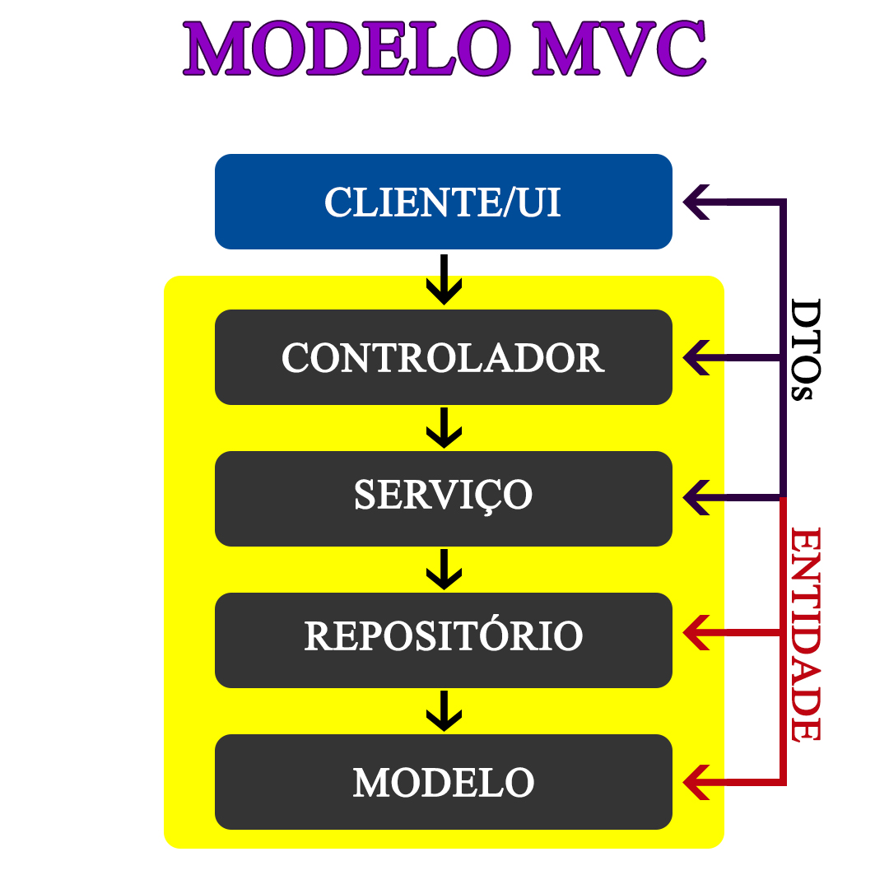

# Projeto LP2 - Biblioteca

## Sobre

Projeto de um sistema gerenciador de biblioteca para a Unidade 2 da disciplina de Linguagem de Programação 2.

## O que foi usado?
Para realizar o projeto, usei uma variação do modelo MVC (acredito ser algo do Spring) e confesso que ainda estou me acostumando com o MVC de forma geral. Segue a imagem explicativa do modelo utilizado:



## Login e senha

```
login: admin
senha: admin
```

## Inserção de datas

Ao usar o sistema, pode inserir a data usando o formato comum:

```
Exemplo: 26/06/2024
```

## Mapa de menus

Segue abaixo o mapa de menus para melhor localização das funções da aplicação:

```
1. Gerenciar usuários.
  1. Cadastrar usuário.
    1. Cadastrar estudante.
    2. Cadastrar professor.
    3. Cadastrar bibliotecário.
    4. Voltar.
  2. Remover usuário.
    1. Remover usuário (necessário informar a matrícula).
    2. Consultar matrícula do usuário.
    3. Voltar.
  3. Consultar usuários.
    1. Listar todos os usuários.
    2. Pesquisar usuário.
    3. Verificar situação de usuário.
    4. Listar empréstimos ativos de usuário.
    5. Voltar.
  4. Voltar.

2. Gerenciar livros.
  1. Cadastrar livro.
  2. Remover livro.
  3. Consultar livros.
    1. Listar todos os livros.
    2. Pesquisar livro.
      1. Título.
      2. Autor.
      3. Assunto.
      4. ISBN.
    3. Voltar.
  4. Voltar.

3. Gerenciar empréstimos.
  1. Registrar empréstimo.
  2. Registrar devolução.
  3. Consultar empréstimos.
    1. Listar todos os empréstimos.
    2. Listar devoluções em atraso.
    3. Voltar.
  4. Voltar.

4. Sair.
```

## Obrigado pela atenção!

Espero que tenha uma ótima experiência de uso!🥹
